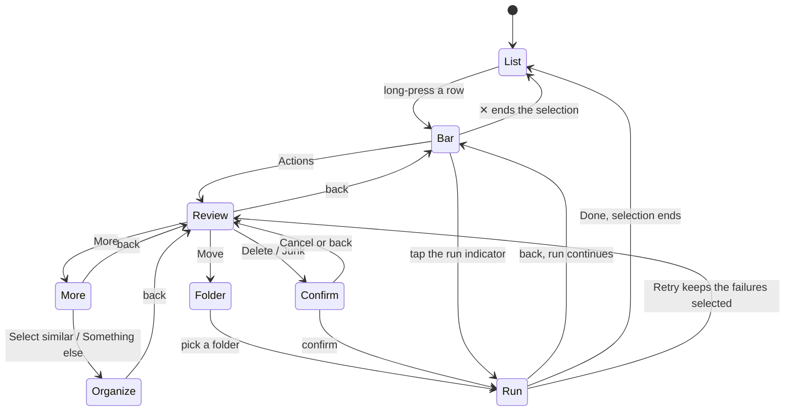

# The mobile selection flow is a screen, not a sheet

Status: proposed — awaiting the owner's approval
Scope: the mobile multi-select surface (`SelectionSheet`), its wiring in `MessageList`, the mobile organize entry (`MobileOrganizeFlow`), and the mobile presentation of the move-to-folder picker. Desktop's `SelectionToolbar` is out of scope and unchanged.
Device of record: 411×759 CSS px, Android Chrome, one thumb.

## What the flow is

Multi-select has two jobs and they belong on different surfaces.

Building a selection is iterative and happens against the list. The user long-presses a row, then adds and removes rows while reading them. That job needs the list visible and needs a count that updates as it changes.

Acting on a selection is a decision made once. It needs the scope stated, the members visible, the verb chosen, the destructive case confirmed, and the outcome reported. That job needs room, and today it does not have any.

The selection bar does the first job. A full-screen flow does the second. Nothing does both.

## What the flow is not

It is not a redesign of organize. `OrganizeRuleEditor` and its screens are re-hosted inside the flow and otherwise untouched.

It is not a new count. The exact number of rows matching a predicate over a whole mailbox is not available from any endpoint today, and this design renders no such number until it is.

It is not a desktop change. Desktop keeps the sticky `SelectionToolbar` it has.

## The failure case

A user searches `npm`, selects the 47 loaded rows, accepts "Select all matching npm", waits through `Counting… 1,900 so far`, sees `All 3,412 matching "npm" selected`, taps Delete, reads `Move about 3,412 messages to Trash?`, and confirms.

Nothing in that sequence showed the user a single message. The one number in it was produced by paging the entire result set through the browser (`countMatches`, `packages/web-client/src/lib/bulk-actions.ts:218`), and the ticker that led to it rendered a running page-through as progress. The confirmation hedged the number with "about" because the number could not be trusted. Then 3,412 messages moved to Trash.

The clipping bug (#405) is the proximate symptom of the same thing. `SelectionSheet` accumulated a select-all row, three quick actions, two smart-flow rows, a progress bar, a status line with five branches and a notice banner with five more, and at 411×759 its own content outgrew the box it drew for itself. PR #407 gave the box a scrollbar. It did not reduce what the box carries.

## What #210 got right, and is preserved

Issue #210 specified the peeking sheet. Four of its properties are load-bearing and survive here.

The selection survives the gesture. #210: "it collapses back to the teaser and **the selection is unchanged**." Here: leaving the flow returns to the list with the selection intact, and only the bar ends a selection.

The list stays visible while selecting. The teaser at 56px plus the list's matching bottom padding is why multi-select works at all on a phone. The bar is the same 56px with the same padding.

The verbs are the same bounded verbs, not new ones. #210: "it runs the **same bounded verb the top bar runs today**." No verb is added, removed or redefined here; they move.

Escalation states are not dropped. #210: "**the states the top bar shows now are not dropped**." Every state in the inventory below has a destination.

Two of #210's properties are deliberately given up. It made the sheet "the sole mobile selection surface"; there are now two, a bar and a flow, and D1 argues why. It said "**do not re-derive the drag math**"; the drag is not re-derived, it is deleted, and D4 argues why.

## Inventory of the current sheet

Every element `SelectionSheet` carries, and where it goes. Nothing may be dropped without a row here saying so.

| # | Element | Copy today | Kind | Source of the number | Destination |
|---|---|---|---|---|---|
| 1 | Grabber, two-snap drag | — | control | — | Deleted (D4) |
| 2 | Status label, materialized | `{N} messages selected` | count | `selectedIds.size`, exact over loaded rows | Bar, and Review header |
| 3 | Status label, all-loaded | `All {N} loaded selected` | count | same, exact | Review scope row |
| 4 | Status label, counting | `Counting… {N} so far` | count | page-through tally | Deleted (D7) |
| 5 | Status label, big result | `Counting… {N} so far. This is a big result set.` | count | page-through tally | Deleted (D7) |
| 6 | Status label, escalated | `All {N} matching "{q}" selected` | count | frozen page-through | Review header, without the number (D7) |
| 7 | Teaser hint | `Swipe up for actions` + chevron | affordance | — | Bar's `Actions` control |
| 8 | Mark-as-read icon | aria `Mark as read` | verb | — | More screen |
| 9 | Cancel / stop `✕` | aria `Cancel selection` | control | — | Split: bar `✕` ends the selection, Run screen `Stop` stops a run (D11) |
| 10 | Select-all checkbox + label | `Select all loaded` | scope control | — | Review scope row, relabelled `Select all {N} loaded` (D12) |
| 11 | Delete quick action | `Delete` | verb | — | Review footer |
| 12 | Move quick action (`moveSlot`) | `Move` | verb | — | Review footer, opening the folder screen (D3, screen map) |
| 13 | Junk quick action | `Junk` | verb | — | Review footer, same visibility rules |
| 14 | Smart row, primary | `Select similar messages` / `find more like these` | entry | — | More screen |
| 15 | Smart row, secondary | `Something else` / `just deal with these` | entry | — | More screen |
| 16 | Progress bar | — | progress | `done` per applied chunk | Run screen (D8) |
| 17 | Notice, counting | empty text + `Stop` | control | — | Run screen `Stop` |
| 18 | Notice, escalated | empty text + `Clear selection` | control | — | Review scope row, `Just the {N} loaded` |
| 19 | Notice, offer | empty text + `Select all matching "{q}"` | entry | — | Review scope row, widen row |
| 20 | Notice, partial failure | `{n} moved to Trash. {m} couldn't be deleted.` + `Retry {m}` | outcome | exact work counts | Run screen outcome, with the failed rows listed (D9) |
| 21 | Notice, cross-account | `Move only works within one account — clear selection or pick messages from a single account` | restriction | — | Inline note on the Move verb, Review footer |
| 22 | Completion banner | `{n} moved to Trash. Your mail server is still catching up.` | outcome | exact work count | Run screen outcome; the list-level banner after exit is unchanged |
| 23 | Delete confirmation | `Move about {N} messages to Trash?` | count | frozen page-through | Confirm screen, without "about" (D7) |
| 24 | `inert` collapsed subtree | — | mechanism | — | Deleted with the second snap point |
| 25 | List bottom padding | `SELECTION_SHEET_TEASER_HEIGHT` = 56 | layout | — | Kept, same value, exported by the bar |

Numbers appearing elsewhere in the flow and inherited unchanged: the organize rule preview's `{N} messages match` (server-side, `POST /organize/preview`), the widen chip's `Similar to these {N}` (client selection size), and the organize job's `{applied} of {matched} moved · {failed} failed`.

## Decisions

### D1 — The bar reports the selection; the flow acts on it

Two surfaces. A 56px selection bar pinned to the bottom of the list carries the count, an exit, and one entry into the flow. A full-screen flow carries everything else. The bar carries no verb, no scope control, no escalation offer, no banner, and no confirmation.

Buys: the surface that must coexist with the list is small enough to never compete with it, and the surface that carries the decision has a whole viewport. Gives up: the single-surface property #210 established, and one tap between the list and every verb.

### D2 — The flow is a route, not an overlay

The flow is a search parameter on the existing mailbox route, the same mechanism `selectedMessageId` already uses: `/mail/$mailboxId?selection=review|more|folder|confirm|run`. It is not a `BottomSheet`, not a `Dialog`, and not absolutely positioned inside the list pane.

Buys: the Android back gesture becomes the flow's back button, which matters more than any on-screen control because the top-left corner is out of thumb reach; and a screen stack replaces the `useBlocker` interception of `BACK` for everything above the bar. Gives up: the selection flow now appears in history, so a mid-flow reload lands on a screen whose selection no longer exists and must fall back to the list.

An alternative was a child route `/mail/$mailboxId/selection/review`. It was rejected because `routes/mail/$mailboxId.tsx` renders `null` and the pane is mounted by the layout, so a child route has nothing to nest inside without restructuring the layout first.

### D3 — Full-screen on single-pane tiers; the panel presentation is the tablet's, not a second design

The flow takes the whole viewport below 768px. Between 768px and 1024px — the tablet tier that currently gets the mobile sheet — the same screens render in a centred panel with a maximum width, inside the same route. At and above 1024px the route is not offered and `SelectionToolbar` is unchanged.

Buys: one set of screens and one state matrix for every tier that has one pane, and no full-bleed 1023px-wide confirmation dialog. Gives up: desktop and mobile selection remain two surfaces with two sets of copy to keep in agreement, mitigated only by both consuming the same kit components.

### D4 — The second snap point is deleted

The bar does not expand. There is no teaser-to-content drag, no rubber band, no flick resolution, no lock, and no `inert` offscreen subtree. `resolveSheetSnap` and the pointer handling in `selection-sheet.tsx` go with the component.

Buys: the class of bug #405 belongs to cannot recur, because no surface is any longer sized between "enough for a summary" and "enough for its content"; and roughly 200 lines of pointer maths, capture-swallowing workarounds and measurement effects are removed. Gives up: the gesture #210 specified, and with it the ability to glance at the verbs without leaving the list.

Deleting it leaves `BottomSheet` with no caller once organize is re-hosted (D10). It should be deleted in the same wave rather than kept for a hypothetical second user.

### D5 — A screen that states a scope shows its members

Every screen that names what will be acted on renders the messages it means: the selected rows for a materialized selection, the first page of matches for a predicate. A scope stated only as words or a number is not a permitted state.

Buys: the thing full-screen gives up — the list as context — is paid back with more of the selection visible than the list showed, and the failure case above becomes impossible to walk through blind. Gives up: a request per predicate preview, and vertical space that would otherwise hold controls.

### D6 — The selection is editable from the flow

Rows in the Review screen's preview carry their checked state and can be deselected there. Deselecting the last row returns to the list.

Buys: correcting a mis-selection no longer requires leaving the flow, finding the row in the list, and coming back. Gives up: a second place that mutates the selection, so the preview and the list must read from the same selection state rather than a copy.

### D7 — Three kinds of count, and the predicate tier has none

A number shown in this flow is one of exactly three things.

Exact and client-owned: the size of the materialized selection. It is the cardinality of a set of loaded rows, it cannot change when another page loads, and it is the exemption the boundary document records at audit row 21. Rendered as a number, always.

Exact and server-owned: the number of rows in a mailbox matching a predicate, under D4 of `docs/architecture/mail-list-boundary.md`. `searchThreads` does not return it today — `countByMailbox` computes it and discards it with `Math.min(count, cap)` — and #305 is unbuilt. Not rendered.

Absent: the predicate tier, today. The scope is rendered as the predicate in words, with no number and no hedge. `Everything matching "npm" in Inbox`, not `All 3,412 matching "npm"` and not `about 3,412`.

Consequently `Counting… {N} so far` and `Counting… {N} so far. This is a big result set.` are deleted, not restyled: a running page-through tally presented as progress is the shape `mail-list-boundary.md` D4 forbids, and there is nothing to count through once the number is not shown. `about` leaves the delete confirmation with the same sentence. Every screen that would carry the exact predicate total reserves a slot for it in the same position, so #305 lands as a copy change and not a re-layout.

Buys: no number in this flow is a page length, and the design does not block on #305. Gives up: the predicate tier's magnitude is invisible until #305, so a user deleting an unbounded match set is told what matches but not how much.

### D8 — Progress is determinate only when the total is exact

A run over a materialized selection knows its total and renders a determinate bar with `{done} of {total}`. A run over a predicate does not, and renders an indeterminate bar with an exact `{done}` and no total. `done` is a count of completed work, not a window length, and is exact in both cases.

Buys: the progress bar never implies a denominator that was guessed. Gives up: the predicate run gives no sense of how far along it is, which for a large mailbox is the case where a user most wants one.

### D9 — Partial failure is a screen with the failures listed

When a run leaves failures, the outcome screen states both exact counts and renders the failed messages as a preview list, with `Retry {m}` acting on exactly those.

Buys: `340 couldn't be moved` becomes answerable — the user can see which 340 and decide, instead of retrying a set they cannot inspect. Gives up: the failed ids must be materialized to be rendered, so a predicate run's failures are listed only to the extent the run reports them.

### D10 — Organize is re-hosted, not redesigned

`MobileOrganizeFlow`'s stages become screens in this flow's stack. The `BottomSheet` wrapper, the scrim, its drag-to-dismiss, and the z-40-over-z-30 stacking go. `OrganizeRuleEditor`, `SomethingElsePanel`, the widen preview and every commit state are unchanged.

Buys: two overlapping overlays inside a 759px viewport become one screen stack, and dismissing organize stops destroying the selection — today `onClose` calls `exitSelection()`, so a user who opens the rule editor and changes their mind loses every row they picked. Gives up: organize's stages must agree with this flow's back semantics, which is a change to how they close even though their content is untouched.

### D11 — The bar is the only place a selection ends

Back pops one screen. Back from the flow's first screen returns to the list with the selection intact. Only the bar's `✕` ends a selection, and only the Run screen's `Stop` stops a run. No screen offers both a back and an exit.

Back during a run returns to the list rather than trapping the user; the bar then shows the run's state and re-enters the Run screen when tapped. This is the one exception to D1's rule that the bar carries no progress, and it is taken because the Android back gesture is a reflex that cannot be designed away. The `useBlocker` interception of `BACK` survives only for the bar-only state, where back still ends the selection as it does today.

Buys: one exit, an unambiguous back at every depth, and no screen the OS gesture cannot leave. Gives up: leaving a run is now possible, and #112 — a bulk run does not survive leaving the mailbox — becomes reachable by one more path than before. It is not fixed here.

### D12 — Scope controls live where the scope is stated

Select-all-loaded and the escalation offer are changes to what the selection means, not actions on it. Both live on the Review screen, above the preview, and neither appears on the bar.

Buys: the two controls most likely to surprise a user sit next to the sentence that says what is currently selected and above the messages it currently means. Gives up: select-all-loaded costs one tap more than it does today.

### D13 — The escalated predicate inherits the active filter, and the scope line says so

The mailbox list can be narrowed by the category and attribute chips (#315, #309). An escalation from that list means "every match **within the active filter**", the request carries those chips, and the scope line names them. The preview under it is the first page of that same predicate.

Buys: escalating from a filtered list cannot silently select outside what the user was looking at. Gives up: a dependency on #306 landing the server-side filter path before the escalated tier is correct, and a scope line that grows a clause per active chip.

### D14 — No new API surface

Nothing here needs an endpoint. The materialized preview is the loaded rows the client already holds. The predicate preview is the first page of `searchThreads` with the predicate the escalation already sends. The organize preview count is the existing `POST /organize/preview`.

One thing this design wants and cannot have: the exact number of rows matching a predicate over a whole mailbox. `searchThreads` accepts `count: true` and returns a value clamped to one page, which under D7 is not renderable. That is #305, and D7 defines the design's behaviour without it rather than assuming it.

### D15 — Storybook first, including the removals

Every screen and every state in the state table lands as a kit component with stories before any app wiring depends on it, per `mail-list-boundary.md` D8. The wave that deletes `SelectionSheet` deletes its stories and render tests in the same change; a state that no longer exists must not survive in Storybook.

Buys: each screen is reviewable at 411×759 before app code depends on it, using the `mobileShort` viewport #407 added. Gives up: an extra issue per screen, which serialises work that could otherwise land in one pass.

### D16 — Verbs sit in the bottom 72px; the back chevron is not a thumb target

On 411×759 held in one hand, the comfortable arc from the bottom-right reaches roughly the bottom 500px. The top 200px is a stretch and the top-left corner is the worst point on the screen.

Every verb, every confirm and every stop is in the bottom 72px. The header's back chevron is a pointer and assistive-technology affordance; the OS edge-swipe is the thumb's back. On the Confirm screen the buttons are stacked full-width with the destructive action on top and Cancel nearest the thumb, so the closest control is the reversible one.

Buys: no action requires a second hand or a grip shift, and the destructive confirm is not the easiest thing to hit. Gives up: the conventional right-hand placement of a primary confirm, and vertical space to a 72px footer on every screen.

## Screen map

Six surfaces. What each is for, and what it must never carry.

| Surface | For | Must never carry |
|---|---|---|
| **Selection bar** (in the list) | The count, an exit, and the way in | Any verb, any scope control, the escalation offer, a banner, a confirmation |
| **Review** (`?selection=review`) | Scope, members, and the bounded verbs | Rule editing, a run's progress, a retry list, filter chips |
| **More** (`?selection=more`) | The infrequent verbs and the two organize entries | Destructive verbs — they stay adjacent to the scope line on Review |
| **Folder** (`?selection=folder`) | Picking a move destination, and creating one | Any verb other than move, the selection preview |
| **Confirm** (`?selection=confirm`) | Stating what a destructive verb will do, honestly | Anything editable, including the selection preview's checkboxes |
| **Run** (`?selection=run`) | In-flight progress, then the outcome | Any verb other than Stop, Retry and Done |
| **Organize** (re-hosted, D10) | The existing rule flow | Anything new |

## Layouts

411×759. Heights in CSS px.

Selection bar, in the list:

```
┌─────────────────────────────────────────┐
│ ⌂  Inbox                        🔍  ⋮   │  56  MailListHeader
│ Filters · Personal                   ⌄  │  40  FilterSheet summary
├─────────────────────────────────────────┤
│ ☑ Stripe        Invoice 4821       2d   │
│ ☑ GitHub        [#405] drawer      2d   │      list, padded 56 at the bottom
│ ☐ Ana           Re: Friday         3d   │
│                    ⋮                    │
├─────────────────────────────────────────┤
│ ✕   12 selected              Actions ›  │  56  selection bar
└─────────────────────────────────────────┘
```

Review, materialized selection:

```
┌─────────────────────────────────────────┐
│ ‹   12 selected                         │  56  header
│     in Inbox · Personal                 │
├─────────────────────────────────────────┤
│ ☐   Select all 47 loaded                │  48  scope
│ ✦   Every match in this folder        › │  56  offer (only when a further page exists)
├─────────────────────────────────────────┤
│ Selected messages                       │  32
│ ☑ Stripe        Invoice 4821       2d   │
│ ☑ GitHub        [#405] drawer      2d   │      scrolls
│ ☑ npm           2FA reminder       3d   │
│                    ⋮                    │
├─────────────────────────────────────────┤
│   🗑        📁        ⚠        ⋯         │  72  verbs
│ Delete     Move     Junk     More       │
└─────────────────────────────────────────┘
```

Review, escalated to a predicate. No number; the offer row is replaced by the way back to the bounded tier.

```
│ ‹   Everything matching "npm"           │  56
│     in Inbox · Personal                 │
├─────────────────────────────────────────┤
│ ↩   Just the 47 loaded                  │  48
├─────────────────────────────────────────┤
│ First matches                           │  32
│   npm           2FA reminder       3d   │      no checkboxes: not a
│   npm           audit advisory     5d   │      materialized selection
│                    ⋮                    │
│ Showing the first 20 of every match in  │  32  completeness sentence
│ this folder.                            │
├─────────────────────────────────────────┤
│   🗑        📁        ⚠        ⋯         │  72
```

Confirm, predicate tier:

```
┌─────────────────────────────────────────┐
│ ‹   Move to Trash                       │  56
├─────────────────────────────────────────┤
│ Delete everything matching "npm" in     │
│ Inbox?                                  │
│                                         │
│ Every message in this folder that       │
│ matches is moved to Trash. New mail     │
│ arriving during the delete is not       │
│ included. You can restore from Trash    │
│ later.                                  │
│                                         │
│ First matches                           │
│   npm           2FA reminder       3d   │
│   npm           audit advisory     5d   │
│ Showing the first 20 of every match in  │
│ this folder.                            │
├─────────────────────────────────────────┤
│ [           Move to Trash           ]   │  48
│ [              Cancel               ]   │  48  nearest the thumb
└─────────────────────────────────────────┘
```

Run, determinate and indeterminate:

```
│ ‹   Deleting…                           │  56
├─────────────────────────────────────────┤
│ ▓▓▓▓▓▓▓▓▓░░░░░░░░░░░                    │      determinate
│ 1,200 of 3,412                          │
                    or
│ ▓▓▒▒▓▓▒▒▓▓▒▒▓▓▒▒▓▓▒▒                    │      indeterminate
│ 1,200 done                              │
├─────────────────────────────────────────┤
│ [               Stop                ]   │  48
```

Run, partial failure:

```
│ ‹   Delete finished                     │  56
├─────────────────────────────────────────┤
│ 3,072 moved to Trash.                   │
│ 340 couldn't be moved.                  │
│                                         │
│ Couldn't move                           │
│   Stripe        Invoice 4821       2d   │
│   GitHub        [#405] drawer      2d   │      scrolls
│                    ⋮                    │
├─────────────────────────────────────────┤
│ [            Retry 340              ]   │  48
│ [              Done                 ]   │  48
```

## Navigation model



Back pops exactly one screen and never ends a selection. Dismissing means the bar's `✕`, and it exists in one place. A reload mid-flow has no selection to restore and lands on the list.

## States

Every state the flow can be in, what puts it there, and what is on screen. The bar's presence rule changes: it appears at one selected row, where today no surface appears at all, because a long-press that selects one row currently produces nothing.

| State | Trigger | Bar | Flow |
|---|---|---|---|
| Empty | no rows selected | absent | not reachable |
| One selected | long-press one row | `1 selected` | Review with one preview row |
| Many selected | further taps | `{N} selected` | Review, all verbs |
| All loaded selected | select-all row | `{N} selected` | scope row reads `All 47 loaded selected` |
| Escalation offered | a further page exists and all loaded are selected | unchanged | offer row present |
| Escalated | offer accepted | `Every match selected` | predicate header, no number, no checkboxes, completeness sentence |
| Filtered scope | a category or attribute chip is active | unchanged | scope line names the chips (D13) |
| Move blocked | selection spans accounts | unchanged | Move disabled with `Move only works within one account.`; Junk hidden |
| No Junk mailbox, or in Junk | `junkMailboxId` unset or equal to the current mailbox | unchanged | Junk absent; footer is Delete, Move, More |
| Confirming | Delete or Junk | unchanged | Confirm screen, no verbs behind it |
| Running, exact total | a bounded run | run indicator, `{done} of {total}` | determinate bar, Stop |
| Running, absent total | a predicate run | run indicator, `{done} done` | indeterminate bar, Stop |
| Stopped | Stop, or the run errors with nothing applied | `{N} selected` | Review, selection unchanged, no notice |
| Complete | the run finishes clean | absent | outcome, then Done ends the selection |
| Partial failure | the run reports failures | `{m} selected` | outcome with both counts and the failed rows listed, `Retry {m}` |
| Error | the request fails | `{N} selected` | outcome screen with the failure title and a `Try again` |

## Seam shapes

The screens are presentational. They fetch nothing, filter nothing, count nothing and sort nothing. Two prop shapes carry the values the boundary rules turn on, and neither is a boolean.

Scope is a discriminated value, and the predicate arm's total is optional so that its absence is the default rather than a flag:

```ts
type SelectionScope =
  | { kind: "loaded"; count: number; allLoaded: "all" | "some" }
  | { kind: "predicate"; predicate: SearchPredicate; filters: FilterClause[]; total?: number };
```

Progress is a discriminated value, so an absent total cannot be defaulted to a page length:

```ts
type SelectionProgress =
  | { kind: "determinate"; done: number; total: number }
  | { kind: "indeterminate"; done: number };
```

Preview reach reuses `FilterReach` from `packages/ui/src/components/message-list-state.tsx` — `"whole-folder" | "loaded-pages"` — so the completeness sentence in this flow and the one in the filtered empty state are the same two sentences.

## Copy

| Where | String |
|---|---|
| Bar, count | `{N} selected` |
| Bar, exit | aria `Cancel selection` |
| Bar, entry | `Actions` |
| Bar, running | `{done} of {total}` / `{done} done` |
| Review header, loaded | `{N} selected` / `in {mailbox}` |
| Review header, loaded and filtered | `{N} selected` / `in {mailbox} · {chips}` |
| Review header, predicate | `Everything matching "{q}"` / `in {mailbox} · {chips}` |
| Review header, predicate by sender | `Everything from "{from}"` |
| Scope, select all | `Select all {N} loaded` |
| Scope, all selected | `All {N} loaded selected` |
| Scope, offer | `Every match in this folder` / `Not just the {N} loaded.` |
| Scope, de-escalate | `Just the {N} loaded` |
| Preview heading, loaded | `Selected messages` |
| Preview heading, predicate | `First matches` |
| Completeness, whole folder | `Showing the first {N} of every match in this folder.` |
| Completeness, loaded pages | `Only the messages loaded so far were checked.` |
| Verbs | `Delete` · `Move` · `Junk` · `More` |
| Move restriction | `Move only works within one account.` |
| More screen | `Mark as read` · `Apply label` · `Select similar messages` · `Something else` |
| Confirm, bounded | `Move {N} messages to Trash?` / `You can restore them from Trash later.` |
| Confirm, one | `Move 1 message to Trash?` |
| Confirm, predicate | `Delete everything matching "{q}" in {mailbox}?` / `Every message in this folder that matches is moved to Trash. New mail arriving during the delete is not included. You can restore from Trash later.` |
| Confirm buttons | `Move to Trash` · `Cancel` |
| Run title | `Deleting…` · `Moving…` · `Marking as read…` |
| Run control | `Stop` |
| Outcome, clean | `{n} moved to Trash. Your mail server is still catching up.` · `Done` |
| Outcome, partial | `{n} moved to Trash.` / `{m} couldn't be moved.` / heading `Couldn't move` / `Retry {m}` |
| Outcome, error | `Couldn't delete these messages` / `The delete didn't finish.` / `Try again` |

Deleted: `Swipe up for actions`, `Select all loaded`, `Counting… {N} so far`, `Counting… {N} so far. This is a big result set.`, `All {N} matching "{q}" selected`, `Move about {N} messages to Trash?`, `find more like these`, `just deal with these`, and the long form of the cross-account hint.

## What full-screen gives up

The list stops being visible at the moment the verb is chosen. On the bounded tier that loss is covered by D5's preview, which shows more of the selection than the list did. On the predicate tier it is not fully covered: the preview shows the first page of matches and the completeness sentence, and under D7 there is no number, so the user knows what matches and not how much. That is the honest state of the data, and it is worse than today only in that today's number was wrong.

Selecting and acting are now separated by a tap in both directions. A user who selects three rows and wants them gone pays one tap more than the sheet's teaser-plus-drag, or one fewer than the teaser-plus-drag-plus-tap, depending on whether the drag lands. There is no version of this where both jobs are one tap away.

The flow appears in history. Reload, a share sheet, or a deep link can land on a screen with no selection behind it, and every screen needs the fall-back to the list. A sheet had no such state.

## Dependencies and known gaps

#306 must land for D13 to be correct: until the mailbox list asks the server for the filtered page, an escalation from a filtered list is a predicate over data the client narrowed.

#305 is the blocker for any number on the predicate tier. D7 defines the flow without it.

#112 — a bulk run does not survive leaving the mailbox — is reachable by one more path under D11 and is not fixed here.

#113 — Stop does not cancel the in-flight request — is inherited unchanged; the Run screen's Stop has exactly today's behaviour.

`listFilter` and `listScopeLabel` exist on `MessageListPane` and are storied and tested, but `MessageList` does not pass them, so #327's filtered empty state is unreachable in the running app. This flow reuses that component's `FilterReach` type and its two completeness sentences; it does not depend on the props being wired.

## FAQ

**Why not just make the sheet taller?** #407 already did, and the sheet still carries four modes, ten copy branches and every verb in one box. The height was the symptom of the density, not its cause.

**Isn't a full screen for deleting three emails heavy-handed?** For three emails you see three previews and a Delete button, which is one screen with four things on it. The screen is not heavier than the sheet's expanded state; it is the same content with room around it.

**Why can I no longer glance at the actions without leaving the list?** Because that glance is what the second snap point bought, and the second snap point is what broke. D4 takes the trade explicitly: the gesture goes so that no surface is ever sized between a summary and its content again.

**What happens when I hit the back gesture in the middle of a delete?** You go back to the list and the run keeps going, with the bar showing how many are done. Tapping the bar returns you to the run.

**Where did the count go when I select everything matching a search?** There is no honest one to show. The old number was produced by paging the whole result set through the browser, and the server's `count` is clamped to a single page; until #305 returns a real total, the flow names what is selected instead of guessing how much.

**So I could delete an unbounded number of messages without being told how many?** Yes, and you are told what they are — the predicate in words, the first page of matches, and the sentence that says the whole folder was searched. That is strictly more than the old confirmation, which showed a hedged number and no messages.

**Does the selection survive if I back out of the rule editor?** Yes. Today it does not — closing the mobile organize sheet calls `exitSelection()` — and D10 fixes that as a consequence of re-hosting.

**Why does desktop keep its toolbar?** Because desktop has a sticky top bar with room for every verb and a reading pane for context, so the problem this solves does not exist there. A full-screen takeover on a 1440px window would be a regression.

**Can I still select every loaded message in one tap?** In two: the bar, then the scope row. It moved because select-all changes what the selection means, and D12 puts every scope change next to the sentence that states the scope.

**Does any of this need a new endpoint?** No. Previews come from rows the client already has and from the first page of the search the escalation already issues. The one thing missing is the exact predicate total, which is an existing open issue, not new surface.

**Is the tablet a third design?** No. It is the same screens in a narrower column inside the same route; the state matrix and the copy are identical.
